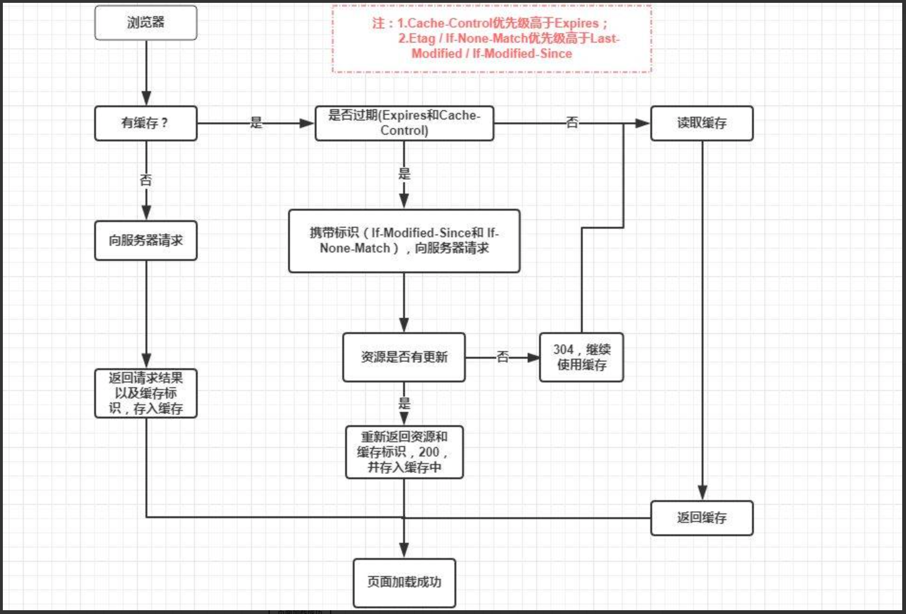

# 浏览器

## 浏览器内核原理
- 主要分成两部分：渲染引擎(layout engineer或Rendering Engine)和JS引擎
- 渲染引擎：负责取得网页的内容（HTML、XML、图像等等）、整理讯息（例如加入CSS等），以及计算网页的显示方式，然后会输出至显示器或打印机。浏览器的内核的不同对于网页的语法解释会有不同，所以渲染的效果也不相同。所有网页浏览器、电子邮件客户端以及其它需要编辑、显示网络内容的应用程序都需要内核
- JS引擎则：解析和执行javascript来实现网页的动态效果
- 最开始渲染引擎和JS引擎并没有区分的很明确，后来JS引擎越来越独立，内核就倾向于只指渲染引擎

### 浏览器常用内核：
- Trident内核：IE,MaxThon,TT,The World,360,搜狗浏览器等。[又称MSHTML]
- Gecko内核：Netscape6及以上版本，FF,MozillaSuite/SeaMonkey等
- Presto内核：Opera7及以上。 [Opera内核原为：Presto，现为：Blink;]
- Webkit内核：Safari,Chrome等。 [ Chrome的Blink（WebKit的分支）]

## 缓存
- [资料](https://juejin.im/entry/6844903593275817998)
- 图谱：

### 强制缓存
- 强制缓存就是向浏览器缓存查找该请求结果，并根据该结果的缓存规则来决定是否使用该缓存结果的过程，强制缓存的情况主要有三种(暂不分析协商缓存过程)。
    - 不存在该缓存结果和缓存标识，强制缓存失效，则直接向服务器发起请求。
    - 存在该缓存结果和缓存标识，但该结果已失效，强制缓存失效，则使用协商缓存(暂不分析)。
    - 存在该缓存结果和缓存标识，且该结果尚未失效，强制缓存生效，直接返回该结果。

- Expires是HTTP/1.0控制网页缓存的字段，其值为服务器返回该请求结果缓存的到期时间，即再次发起该请求时，如果客户端的时间小于Expires的值时，直接使用缓存结果。
- Cache-Control (优先级 > Expires)
    - public：所有内容都将被缓存（客户端和代理服务器都可缓存）。
    - private：所有内容只有客户端可以缓存，Cache-Control的默认取值。
    - no-cache：客户端缓存内容，但是是否使用缓存则需要经过协商缓存来验证决定。
    - no-store：所有内容都不会被缓存，即不使用强制缓存，也不使用协商缓存。
    - max-age=xxx (xxx is numeric)：缓存内容将在xxx秒后失效。

### 协商缓存
- 强制缓存失效后，浏览器携带缓存标识向服务器发起请求，由服务器根据缓存标识决定是否使用缓存的过程。
    - 协商缓存生效，返回304。
    - 协商缓存失效，返回200和请求结果结果。

- Last-Modified / If-Modified-Since
    - Last-Modified是服务器响应请求时，返回该资源文件在服务器最后被修改的时间。
    - If-Modified-Since则是客户端再次发起该请求时，携带上次请求返回的Last-Modified值，通过此字段值告诉服务器该资源上次请求返回的最后被修改时间。

- Etag / If-None-Match（优先级 > Last-Modified / If-Modified-Since）
    - Etag是服务器响应请求时，返回当前资源文件的一个唯一标识(由服务器生成)。
    - If-None-Match是客户端再次发起该请求时，携带上次请求返回的唯一标识Etag值，通过此字段值告诉服务器该资源上次请求返回的唯一标识值。

